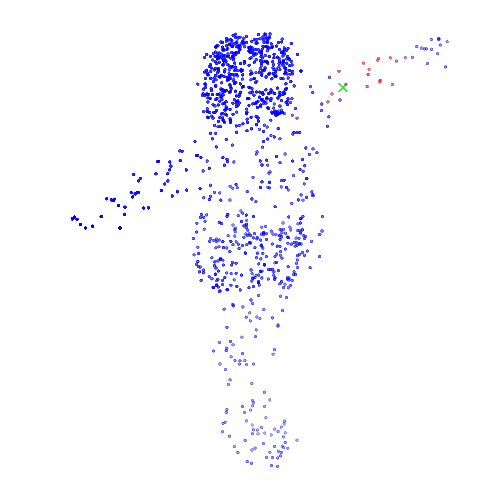

## Computer Graphics Course Projects

> This project presents a competitive pipeline for high-fidelity 3D human reconstruction which is is the implemantion of 6-th Jittor Artificial Intelligence Competition. The backbone of our feature extraction is the powerful **PTCNN**, which excels at capturing global geometric context from sparse point data.

## 🌟 Core Idea 

The reconstruction of a complete 3D human from a raw point cloud $P = \{p_i | p_i \in \mathbb{R}^3\}_{i=1}^N$ is a highly ill-posed problem. Our approach simplifies this challenge by decomposing it into two manageable sub-tasks:

1. **Skeleton Prediction (Coarse Structure):** We first estimate the underlying kinematic skeleton $J = \{j_k | j_k \in \mathbb{R}^3\}_{k=1}^K$, where $K$ is the number of joints.
2. **Skinning Prediction (Detailed Surface):** Conditioned on the predicted skeleton and the input point cloud, we then predict the vertices of a canonical mesh (T-pose) and its associated skinning weights, enabling animation.

| Vertices                                                     | Pred                                                         | GT                                                           |
| ------------------------------------------------------------ | ------------------------------------------------------------ | ------------------------------------------------------------ |
|  |  |  |

| lower left arm                                               | Head                                                         | Chest                                                        |
| ------------------------------------------------------------ | ------------------------------------------------------------ | ------------------------------------------------------------ |
|  |  |  |

### 🔬 **Methodology: A Two-Stage Pipeline**

> More details about the pipeline and network design is coming soon after the competition.

#### Stage 1: Skeleton Estimation

The initial stage focuses on identifying the structural priors of the human body. We model this as a regression task where the network $f_{\text{skel}}$ maps the input point cloud $P$ to a set of 3D joint locations $J$.
$$
J = f_{\text{skel}}(P; \theta_{\text{skel}})
$$

#### Stage 2: Deformable Skinning Prediction

With the skeleton $J$ as a structural guide, the second stage network, $f_{\text{skin}}$, predicts the detailed surface geometry. This stage outputs two key components:
1.  The vertices of a canonical (T-pose) mesh, $V_c \in \mathbb{R}^{M \times 3}$.
2.  The Linear Blend Skinning (LBS) weights, $W \in \mathbb{R}^{M \times K}$, which associate each vertex with the skeleton's joints.

The network takes both the original point cloud $P$ and the predicted skeleton $J$ as input:
$$
(V_c, W) = f_{\text{skin}}(P, J; \theta_{\text{skin}})
$$
The final, posed mesh vertices $V_p$ can then be derived using the standard LBS formulation. For a given pose defined by a set of joint transformation matrices $\{G_k \in SE(3)\}_{k=1}^K$, the position of a vertex $v_{p,i}$ is a weighted average of its transformations by the joints:

$$
v'_{p,i} = \sum_{k=1}^{K} w_{i,k} \cdot G_k \cdot v_{c,i}
$$
where $w_{i,k}$ is the weight of joint $k$ on vertex $i$. This formulation allows the reconstructed human to be re-posed and animated. The loss function for this stage, $\mathcal{L}_{\text{skin}}$, typically involves a Chamfer distance or Earth Mover's Distance (EMD) between the predicted posed mesh and the ground truth surface, along with a regularization term on the skinning weights.

## 🚀 Getting Started (Coming soon)

Follow these instructions to set up the environment and run the project.
